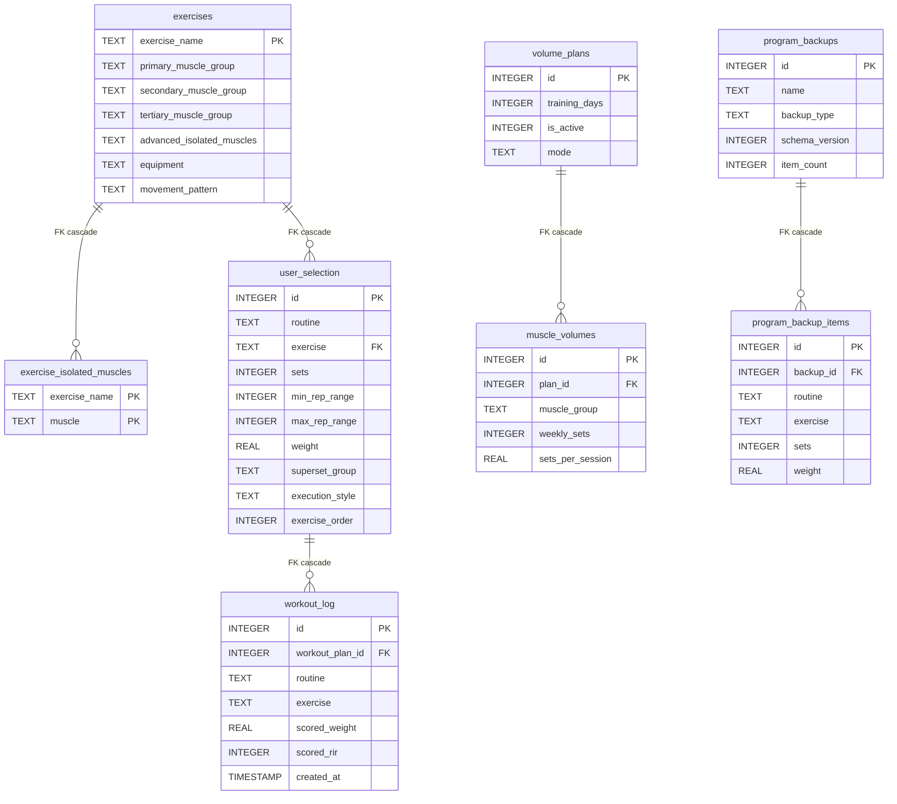

# Backend Schema

*Every table, column, constraint, index, and relationship in the runtime SQLite database.*

**Derived from:** a freshly built runtime database at revision `d1efc93`, read back with
`PRAGMA table_info`, `table_xinfo`, `index_list`, `index_info`, and `foreign_key_list`.
**On conflict, the code wins.** The DDL owners are `utils/db_initializer.py`,
`utils/database.py`, `utils/program_backup.py`, `utils/catalog_upgrade.py`, and
`utils/schema_registry.py`; the orchestration order is `run_all_initializers()` in
`utils/schema_registry.py`.

For *how* to access the database, add a table, or reason about connection PRAGMAs and runtime
paths, see [`../../.claude/rules/database.md`](../../.claude/rules/database.md). This document
is the field-level inventory only.

---

## Single user, by design

There is no `user_id` column anywhere, no tenancy, no ownership, and no authentication table.
That is not an omission to be corrected — it is the product shape. The application is
single-user and local-first, and `.claude/rules/routes.md` states the operating consequence:
**do not expose this application to an untrusted network.**

Several tables are deliberately single-row: `user_profile`, `user_calibration_settings`, and
`fatigue_context_settings` each enforce `CHECK (id = 1)`, and `catalog_version` does the same.
They are settings records, not collections.

## How this inventory was derived

The schema was built twice, by two independent paths, and the results compared:

| Path | How | Result |
|---|---|---|
| **A — empty file** | `run_all_initializers(force_base=True)` against a non-existent database at an isolated `DB_FILE` | 19 tables, 17 indexes |
| **B — real first run** | copy `data/catalog.seed.db`, then `run_all_initializers()` on top — the order `app.py` actually uses | 19 tables, 17 indexes |

**The two paths agree exactly**: identical table sets, identical index sets, and zero
column-shape differences. This matters because the shipped seed is a byte-copied artifact, so
its schema could in principle have drifted from what the initializers build; it has not.

Path B is the one a user's database is actually created by: `app.py` calls
`bootstrap_runtime_database()` (which copies the seed when `DB_FILE` is missing) before
`run_all_initializers()`. Path B's database also arrives populated — 1,897 catalog exercises
and 1,598 isolated-muscle rows — while every user-owned table starts empty. The one table the
seed does not carry is `catalog_version`; the initializers add it.

### Two objects that neither path creates

`utils/maintenance.py` contains three `CREATE INDEX` statements on `exercise_isolated_muscles`.
One of them, `idx_eim_muscle`, **is** in the runtime schema — the initializers create it
independently. The other two are not: a UNIQUE `idx_eim_exercise_muscle` and a single-column
`idx_eim_ex`. Both are absent because `normalize_and_rebuild_eim()` is reachable only from an
explicit `python -m utils.maintenance` invocation and is not part of the startup call graph.

The UNIQUE one is also redundant: `exercise_isolated_muscles` already declares
`PRIMARY KEY (exercise_name, muscle)`, which SQLite implements as
`sqlite_autoindex_exercise_isolated_muscles_1`. So running maintenance adds `idx_eim_ex` and a
duplicate of a constraint that already holds. Recorded here so a future reader who finds those
indexes in a long-lived database knows where they came from.

## Constraint enforcement — read this before trusting a foreign key

SQLite does **not** enforce foreign keys by default; enforcement is a per-connection setting.
This application turns it on in `_configure_connection()` in `utils/database.py`, so every
access through `DatabaseHandler` is enforced.

The practical consequence: **a `sqlite3` shell or an ad-hoc script you write yourself has
foreign keys OFF unless you set `PRAGMA foreign_keys = ON` first**, and will happily create rows
the application would reject. This was verified while building this document — a raw
`sqlite3.connect()` on the freshly derived database reports `PRAGMA foreign_keys` = `0`.

There are no views and no triggers. `user_version` is `0`; the schema is not versioned by that
mechanism. Backup *payloads* carry their own `schema_version` column, which is unrelated.

---

## Relationship diagram

Only the five enforced foreign keys are drawn as relationships. Convention-only references are
listed in the table below the diagram — drawing them here would imply an enforcement that does
not exist.

### Enforced foreign keys — all five of them

| Child | Column | Parent | On delete |
|---|---|---|---|
| `exercise_isolated_muscles` | `exercise_name` | `exercises.exercise_name` | CASCADE |
| `user_selection` | `exercise` | `exercises.exercise_name` | CASCADE |
| `workout_log` | `workout_plan_id` | `user_selection.id` | CASCADE |
| `muscle_volumes` | `plan_id` | `volume_plans.id` | CASCADE |
| `program_backup_items` | `backup_id` | `program_backups.id` | CASCADE |

Every one is `ON DELETE CASCADE` with `ON UPDATE NO ACTION`. Fourteen of the nineteen tables
have no foreign key at all.

Two consequences worth stating outright, because they are load-bearing and non-obvious:

- Deleting a catalog exercise **cascades into the user's plan**, and deleting a plan row
  **cascades into its logged history**.
- `program_backup_items` cascades from `program_backups`, so deleting a backup deletes its rows.

### Convention-only references — no constraint, no cascade

These columns hold an exercise name or a muscle label and are joined to as if they were foreign
keys, but nothing enforces them. A row can name an exercise that does not exist, and nothing
will cascade when the referent is deleted.

| Table | Column | Points at, by convention |
|---|---|---|
| `workout_log` | `exercise` | `exercises.exercise_name` |
| `workout_log` | `routine` | `user_selection.routine` |
| `progression_goals` | `exercise` | `exercises.exercise_name` |
| `learned_strength_calibrations` | `exercise_name` | `exercises.exercise_name` |
| `exercise_transfer_ratios` | `source_exercise_name`, `target_exercise_name` | `exercises.exercise_name` |
| `ignored_calibration_transfers` | `source_exercise_name`, `target_exercise_name` | `exercises.exercise_name` |
| `program_backup_items` | `exercise` | `exercises.exercise_name` |
| `muscle_volumes` | `muscle_group` | canonical muscle labels in `utils/constants.py` |

`workout_log` is the important one: **only** `workout_plan_id` is constrained. The `exercise`
and `routine` columns are denormalized copies, which is what lets a logged session survive its
plan row being edited — and also what lets it name an exercise the catalog no longer has.

The backup-restore path deals with this explicitly rather than relying on the database: it
checks each snapshot row's exercise against the catalog before inserting and reports the
skipped ones (`utils/program_backup.py`).

---

## Tables

Grouped by what they are for. In every table below, `notnull=no` means the column is nullable
and `Default = —` means no default was declared.

Note a SQLite quirk visible throughout: an `INTEGER PRIMARY KEY` column reports as *nullable*
because it is an alias for the implicit `rowid` and is auto-assigned. It is not actually
nullable.

### Exercise catalog — shipped content, user-editable

Owned by `utils/db_initializer.py` and refreshed by `utils/catalog_upgrade.py`. These are the
only tables that arrive with data. They are deliberately **absent** from
`OWNED_TABLES_DROP_ORDER`, so the catalog survives an erase.

#### `exercises`

The exercise catalog: 1,897 rows in the shipped seed.

| Column | Type | Null | Default |
|---|---|---|---|
| `exercise_name` | TEXT | yes | — |
| `primary_muscle_group` | TEXT | yes | — |
| `secondary_muscle_group` | TEXT | yes | — |
| `tertiary_muscle_group` | TEXT | yes | — |
| `advanced_isolated_muscles` | TEXT | yes | — |
| `utility` | TEXT | yes | — |
| `grips` | TEXT | yes | — |
| `stabilizers` | TEXT | yes | — |
| `synergists` | TEXT | yes | — |
| `force` | TEXT | yes | — |
| `equipment` | TEXT | yes | — |
| `mechanic` | TEXT | yes | — |
| `difficulty` | TEXT | yes | — |
| `movement_pattern` | TEXT | yes | — |
| `movement_subpattern` | TEXT | yes | — |
| `youtube_video_id` | TEXT | yes | — |
| `media_path` | TEXT | yes | — |

**PK** `exercise_name` (TEXT). **Indexes**: `sqlite_autoindex_exercises_1` (PK);
`idx_exercise_name_nocase` — `UNIQUE (exercise_name COLLATE NOCASE)`, which is what makes
exercise names case-insensitively unique even though the PK itself is case-sensitive.

The last four columns — `movement_pattern`, `movement_subpattern`, `youtube_video_id`,
`media_path` — are also declared in `utils/db_initializer.py`'s `CREATE TABLE`, so on a fresh
build they arrive with the table. The `ALTER TABLE` statements that add them are guarded by a
`PRAGMA table_info` check taken *after* the create, so they fire only on a pre-existing database
that lacks them.

#### `exercise_isolated_muscles`

Normalized expansion of `exercises.advanced_isolated_muscles` — one row per exercise/muscle
pair, muscle stored lowercase. 1,598 rows in the seed.

| Column | Type | Null | Default |
|---|---|---|---|
| `exercise_name` | TEXT | no | — |
| `muscle` | TEXT | no | — |

**PK** `(exercise_name, muscle)`. **FK** `exercise_name` → `exercises` CASCADE.
**Indexes**: `sqlite_autoindex_exercise_isolated_muscles_1` (PK, UNIQUE); `idx_eim_muscle`.

#### `catalog_version`

Records which shipped catalog the runtime database has absorbed. Single row.

| Column | Type | Null | Default |
|---|---|---|---|
| `id` | INTEGER | yes | — |
| `version` | INTEGER | no | — |
| `content_hash` | TEXT | no | — |
| `applied_at` | TEXT | no | — |

**PK** `id`, with `CHECK (id = 1)`. `content_hash` is a SHA-256 over the shipped catalog's rows;
`upgrade_catalog_from_seed()` compares against it to decide whether an additive refresh is
needed. Deliberately excluded from `OWNED_TABLES_DROP_ORDER` — it is catalog metadata.

### The program

#### `user_selection`

**The workout plan.** One row per exercise in one routine. This is the central user-owned table.

| Column | Type | Null | Default |
|---|---|---|---|
| `id` | INTEGER | yes | — |
| `routine` | TEXT | no | — |
| `exercise` | TEXT | no | — |
| `sets` | INTEGER | no | — |
| `min_rep_range` | INTEGER | no | — |
| `max_rep_range` | INTEGER | no | — |
| `rir` | INTEGER | yes | — |
| `rpe` | REAL | yes | — |
| `weight` | REAL | no | — |
| `superset_group` | TEXT | yes | NULL |
| `execution_style` | TEXT | yes | `'standard'` |
| `time_cap_seconds` | INTEGER | yes | NULL |
| `emom_interval_seconds` | INTEGER | yes | NULL |
| `emom_rounds` | INTEGER | yes | NULL |
| `exercise_order` | INTEGER | yes | — |

**PK** `id`. **FK** `exercise` → `exercises.exercise_name` CASCADE.
**Indexes**: `idx_user_selection_exercise`; and a UNIQUE constraint over
`(routine, exercise, sets, min_rep_range, max_rep_range, rir, rpe, weight)` —
`sqlite_autoindex_user_selection_1`.

That composite UNIQUE is worth understanding: it prevents an *identical* duplicate row in a
routine, but the same exercise may appear twice in one routine as long as any one of those eight
values differs. It also means `NULL` in `rir` or `rpe` behaves per SQL semantics — NULLs are
distinct, so two rows differing only by a NULL are both allowed.

Five columns genuinely arrive by `ALTER TABLE` on a fresh build: `execution_style`,
`time_cap_seconds`, `emom_interval_seconds`, `emom_rounds` from `utils/db_initializer.py`, and
`exercise_order` from `utils/schema_registry.py` — which also backfills existing rows. That is why
they sit at the end of the column order.

`superset_group` is the exception that looks like one and is not: it is declared in the
`CREATE TABLE` above, and its `ALTER` is a guarded upgrade path for databases that predate it.

`superset_group` is the superset link: two rows sharing a non-NULL value are performed
back-to-back.

#### `workout_log`

Logged performance. Each row snapshots the plan values (`planned_*`) alongside what was actually
done (`scored_*`).

| Column | Type | Null | Default |
|---|---|---|---|
| `id` | INTEGER | yes | — |
| `workout_plan_id` | INTEGER | yes | — |
| `routine` | TEXT | no | — |
| `exercise` | TEXT | no | — |
| `planned_sets` | INTEGER | yes | — |
| `planned_min_reps` | INTEGER | yes | — |
| `planned_max_reps` | INTEGER | yes | — |
| `planned_rir` | INTEGER | yes | — |
| `planned_rpe` | REAL | yes | — |
| `planned_weight` | REAL | yes | — |
| `scored_weight` | REAL | yes | — |
| `scored_min_reps` | INTEGER | yes | — |
| `scored_max_reps` | INTEGER | yes | — |
| `scored_rir` | INTEGER | yes | — |
| `scored_rpe` | REAL | yes | — |
| `last_progression_date` | TEXT | yes | — |
| `created_at` | TIMESTAMP | yes | `CURRENT_TIMESTAMP` |

**PK** `id`. **FK** `workout_plan_id` → `user_selection.id` CASCADE. No other index.

Every `scored_*` column is nullable, which is the contract that lets a user log partially — and
which the fatigue and progression code must handle. `workout_plan_id` is itself nullable, so a
log row can exist detached from any plan row.

`created_at` is the only session date. There is no separate `session_date`; date filtering keys
off this column.

### Progression

#### `progression_goals`

User-created targets. Written only by explicit user action; nothing writes here automatically.

| Column | Type | Null | Default |
|---|---|---|---|
| `id` | INTEGER | yes | — |
| `exercise` | TEXT | no | — |
| `goal_type` | TEXT | no | — |
| `current_value` | REAL | yes | — |
| `target_value` | REAL | yes | — |
| `goal_date` | DATE | no | — |
| `created_at` | DATETIME | no | — |
| `completed` | BOOLEAN | yes | `0` |
| `completed_at` | DATETIME | yes | — |

**PK** `id`. No FK, no index. `goal_type` is validated in application code, not by a CHECK.

### Volume planning

#### `volume_plans`

| Column | Type | Null | Default |
|---|---|---|---|
| `id` | INTEGER | yes | — |
| `training_days` | INTEGER | no | — |
| `created_at` | DATETIME | no | — |
| `is_active` | INTEGER | no | `0` |
| `mode` | TEXT | no | `'basic'` |

**PK** `id`. **Index**: `idx_volume_plans_single_active` —
`UNIQUE (is_active) WHERE is_active = 1`.

That partial unique index is the interesting one: it permits any number of rows with
`is_active = 0` while allowing **at most one** active plan. The "only one active plan" rule is
enforced by the database, not only by application code. `is_active` and `mode` are `ALTER TABLE`
additions in `utils/database.py`.

#### `muscle_volumes`

Per-muscle allocation belonging to one volume plan.

| Column | Type | Null | Default |
|---|---|---|---|
| `id` | INTEGER | yes | — |
| `plan_id` | INTEGER | no | — |
| `muscle_group` | TEXT | no | — |
| `weekly_sets` | INTEGER | no | — |
| `sets_per_session` | REAL | no | — |
| `status` | TEXT | no | — |

**PK** `id`. **FK** `plan_id` → `volume_plans.id` CASCADE. No index beyond the PK — including
none on `plan_id`, so the child lookup is a scan.

### Profile and estimation

#### `user_profile`

Single row. Feeds the Workout Controls strength estimates.

| Column | Type | Null | Default |
|---|---|---|---|
| `id` | INTEGER | yes | — |
| `gender` | TEXT | yes | — |
| `age` | INTEGER | yes | — |
| `height_cm` | REAL | yes | — |
| `weight_kg` | REAL | yes | — |
| `experience_years` | REAL | yes | — |
| `updated_at` | DATETIME | yes | — |

**PK** `id`, `CHECK (id = 1)`. Every field is nullable — a partially filled profile is a
supported state, and the estimator is written to degrade rather than fail.

#### `user_profile_lifts`

Reference lifts, one row per lift key.

| Column | Type | Null | Default |
|---|---|---|---|
| `id` | INTEGER | yes | — |
| `lift_key` | TEXT | no | — |
| `weight_kg` | REAL | yes | — |
| `reps` | INTEGER | yes | — |
| `updated_at` | DATETIME | yes | — |

**PK** `id`. **UNIQUE** `lift_key`. Weight and reps are nullable, so a lift can be present but
unfilled — which the estimator treats as absent rather than as zero.

#### `user_profile_preferences`

Rep-range preference per exercise tier. At most three rows.

| Column | Type | Null | Default |
|---|---|---|---|
| `id` | INTEGER | yes | — |
| `tier` | TEXT | yes | — |
| `rep_range` | TEXT | yes | — |
| `updated_at` | DATETIME | yes | — |

**PK** `id`. **UNIQUE** `tier`.
**CHECK** `tier IN ('complex', 'accessory', 'isolated')` and
`rep_range IN ('heavy', 'moderate', 'light')`.

### Learned calibration

Opt-in machinery that observes logged performance and proposes per-exercise starting numbers.
Off unless enabled.

#### `user_calibration_settings`

| Column | Type | Null | Default |
|---|---|---|---|
| `id` | INTEGER | yes | — |
| `mode` | TEXT | no | `'off'` |
| `allow_related_exercise_learning` | INTEGER | no | `0` |
| `min_sessions_for_related` | INTEGER | yes | — |
| `updated_at` | DATETIME | yes | — |

**PK** `id`, `CHECK (id = 1)`. **CHECK** `mode IN ('off', 'suggest')` — the enum has exactly two
members, and neither of them applies anything automatically.

#### `learned_strength_calibrations`

One row per exercise the system has learned something about.

| Column | Type | Null | Default |
|---|---|---|---|
| `id` | INTEGER | yes | — |
| `exercise_name` | TEXT | no | — |
| `lift_key` | TEXT | yes | — |
| `primary_muscle` | TEXT | yes | — |
| `estimated_1rm` | REAL | yes | — |
| `suggested_weight` | REAL | yes | — |
| `suggested_min_reps` | INTEGER | yes | — |
| `suggested_max_reps` | INTEGER | yes | — |
| `suggested_rir` | INTEGER | yes | — |
| `suggested_rpe` | REAL | yes | — |
| `confidence` | TEXT | yes | — |
| `sample_count` | INTEGER | yes | — |
| `last_log_id` | INTEGER | yes | — |
| `last_observed_at` | TEXT | yes | — |
| `source` | TEXT | yes | — |
| `created_at` | DATETIME | yes | — |
| `updated_at` | DATETIME | yes | — |

**PK** `id`. **UNIQUE** `exercise_name`. `last_log_id` names a `workout_log` row but carries no
FK, so deleting that log row leaves the reference dangling.

#### `exercise_transfer_ratios`

How strength on one exercise maps onto another.

| Column | Type | Null | Default |
|---|---|---|---|
| `id` | INTEGER | yes | — |
| `source_exercise_name` | TEXT | no | — |
| `target_exercise_name` | TEXT | no | — |
| `source_lift_key` | TEXT | yes | — |
| `target_lift_key` | TEXT | yes | — |
| `ratio` | REAL | no | — |
| `load_basis` | TEXT | no | — |
| `relationship_type` | TEXT | no | — |
| `confidence` | TEXT | no | `'medium'` |
| `notes` | TEXT | yes | — |
| `created_at` | DATETIME | yes | `CURRENT_TIMESTAMP` |
| `updated_at` | DATETIME | yes | `CURRENT_TIMESTAMP` |

**PK** `id`. **UNIQUE** `(source_exercise_name, target_exercise_name)`.
**CHECKs**: `ratio > 0`;
`load_basis IN ('total_to_total', 'total_to_per_hand', 'per_hand_to_total', 'per_hand_to_per_hand')`;
`relationship_type IN ('same_lift_key', 'same_pattern', 'manual')`;
`confidence IN ('low', 'medium', 'high')`.

`load_basis` is the dumbbell trap made explicit — 40 kg of dumbbell bench press is 20 kg per
hand, and a ratio is meaningless without knowing which convention each side uses.

#### `ignored_calibration_transfers`

Transfers the user has dismissed.

| Column | Type | Null | Default |
|---|---|---|---|
| `id` | INTEGER | yes | — |
| `source_exercise_name` | TEXT | no | — |
| `target_exercise_name` | TEXT | no | — |
| `created_at` | DATETIME | yes | `CURRENT_TIMESTAMP` |

**PK** `id`. **UNIQUE** `(source_exercise_name, target_exercise_name)`.

### Fatigue

#### `fatigue_context_settings`

Single row controlling whether the fatigue badge appears and what it summarizes.

| Column | Type | Null | Default |
|---|---|---|---|
| `id` | INTEGER | yes | — |
| `enabled` | INTEGER | no | `0` |
| `context_source` | TEXT | no | `'both'` |
| `context_period` | TEXT | no | `'this_week'` |
| `updated_at` | DATETIME | yes | — |

**PK** `id`, `CHECK (id = 1)`.
**CHECK** `context_source IN ('planned', 'logged', 'both')` and
`context_period IN ('this_session', 'this_week', 'last_4_weeks')`.

Default `enabled = 0`: the fatigue context badge is off until the user turns it on.

### Body composition

#### `body_composition_snapshots`

One row per measurement.

| Column | Type | Null | Default |
|---|---|---|---|
| `id` | INTEGER | yes | — |
| `captured_at` | TEXT | no | — |
| `bodyweight_kg` | REAL | no | — |
| `height_cm` | REAL | no | — |
| `neck_cm` | REAL | yes | — |
| `waist_cm` | REAL | yes | — |
| `hip_cm` | REAL | yes | — |
| `age_years` | INTEGER | no | — |
| `gender` | TEXT | no | — |
| `bfp_navy` | REAL | yes | — |
| `bfp_bmi` | REAL | no | — |
| `fat_mass_kg` | REAL | yes | — |
| `lean_mass_kg` | REAL | yes | — |
| `notes` | TEXT | yes | — |

**PK** `id`. **Index**: `idx_body_composition_snapshots_captured_at` on `captured_at DESC`.

The nullability encodes the two estimation methods: `bfp_bmi` is `NOT NULL` because height,
weight, age, and gender are always present, while `bfp_navy` is nullable because it needs the
circumference measurements, which are optional. `fat_mass_kg` and `lean_mass_kg` are nullable
for the same reason — they derive from whichever percentage was available.

### Program backups

Owned by `utils/program_backup.py`. **These are the first two entries in
`OWNED_TABLES_DROP_ORDER`** — see the erase note below.

#### `program_backups`

| Column | Type | Null | Default |
|---|---|---|---|
| `id` | INTEGER | yes | — |
| `name` | TEXT | no | — |
| `note` | TEXT | yes | — |
| `backup_type` | TEXT | no | `'manual'` |
| `schema_version` | INTEGER | no | `1` |
| `item_count` | INTEGER | no | `0` |
| `created_at` | TIMESTAMP | yes | `CURRENT_TIMESTAMP` |

**PK** `id`. **UNIQUE** `(name, created_at)`.
**Indexes**: `idx_backups_created_at` on `created_at DESC`; `idx_backups_type`.

`schema_version` is a **reserved informational label**, not an enforced compatibility contract:
it is written and returned but never read to make a decision, and `restore_backup()` is
deliberately version-blind. See [ADR-007](../DECISIONS.md) and
[`program_backups.md`](../program_backups.md). It is the column the *Constraint enforcement*
section above flags as unrelated to SQLite's `user_version`. Being `NOT NULL`, it also has no
reachable `NULL` state.

#### `program_backup_items`

| Column | Type | Null | Default |
|---|---|---|---|
| `id` | INTEGER | yes | — |
| `backup_id` | INTEGER | no | — |
| `routine` | TEXT | no | — |
| `exercise` | TEXT | no | — |
| `sets` | INTEGER | no | — |
| `min_rep_range` | INTEGER | no | — |
| `max_rep_range` | INTEGER | no | — |
| `rir` | INTEGER | yes | — |
| `rpe` | REAL | yes | — |
| `weight` | REAL | no | — |
| `exercise_order` | INTEGER | yes | — |
| `superset_group` | TEXT | yes | NULL |

**PK** `id`. **FK** `backup_id` → `program_backups.id` CASCADE.
**Index**: `idx_backup_items_backup_id`.

**A snapshot contains plan rows and nothing else.** Compare this column list to
`user_selection`: there is no logged history, no profile, no goals, no body composition, no
volume plan, and no settings. Backing up and restoring does not preserve anything but the
program. `execution_style` and its EMOM/time-cap companions are also absent, so those settings
do not survive a restore.

---

## What an erase actually destroys

`POST /erase-data` calls `drop_all_owned_tables()`, which drops every table in
`OWNED_TABLES_DROP_ORDER` (`utils/schema_registry.py`) in FK-safe order, then reinitializes.
That list is:

`program_backup_items`, `program_backups`, `ignored_calibration_transfers`,
`exercise_transfer_ratios`, `learned_strength_calibrations`, `user_calibration_settings`,
`fatigue_context_settings`, `user_profile_preferences`, `user_profile_lifts`, `user_profile`,
`body_composition_snapshots`, `user_selection`, `progression_goals`, `muscle_volumes`,
`volume_plans`, `workout_log`.

Sixteen of the nineteen tables. **This includes the Backup Center library** — `program_backups`
and `program_backup_items` are the first two dropped. Erasing does not preserve your snapshots.

> **A currently-shipped document contradicts this.** `docs/program_backups.md` states that
> "Backups survive normal erase/reset flows because they are not stored in `user_selection`."
> That is false: not being in `user_selection` is irrelevant, because both backup tables are
> dropped by name. Flagged here rather than corrected, because editing that document is outside
> this documentation packet's scope.

The three tables an erase does **not** drop are `exercises`, `exercise_isolated_muscles`, and
`catalog_version` — the shipped catalog, which is reinstalled content rather than user data.

A pre-erase snapshot is written to `data/auto_backup/` before anything is dropped, so the data
is recoverable as a file. There is no in-application path to restore it; it is a raw SQLite copy
you would replace by hand.

---

## Where the database lives

One resolver, `utils/runtime_paths.py`, owns every mutable path — so the same schema described
above lives in a different place in a source checkout than in a frozen install.

The precedence rules, the legacy-database migration, and the corruption-recovery behavior are
owned by [`../../.claude/rules/database.md`](../../.claude/rules/database.md) and are deliberately
not restated here.
